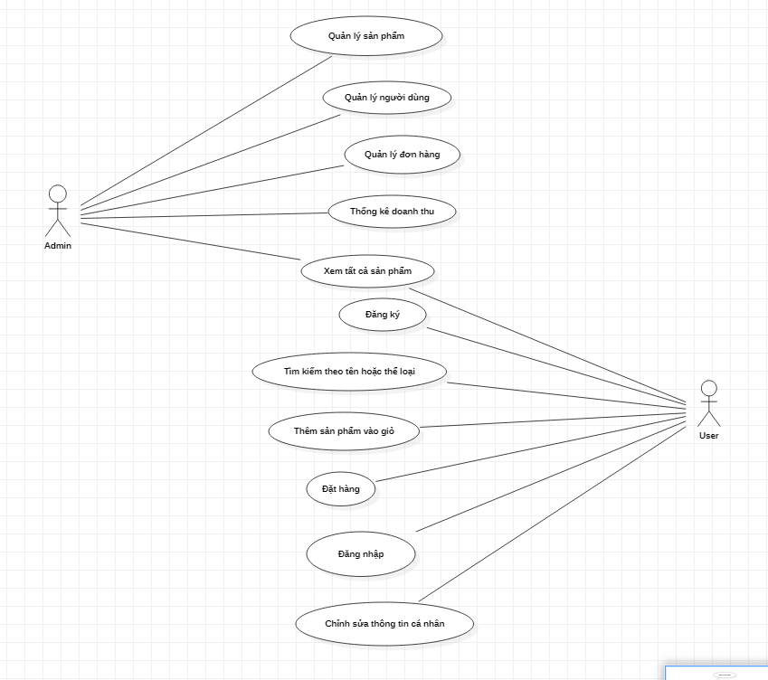

# PHẦN MỀM QUẢN LÝ BÁN SÁCH ONLINE

## I. GIỚI THIỆU
  Phần mềm quản lý bán sách online giúp cho các khách hàng có thể mua sắm online tiện lợi mà không cần phải đến cửa hàng.
  Khách hàng có thể tìm kiếm sách, thực hiện thêm sách muốn mua vào giỏ hàng, và có thể thực hiện mua hàng. khách hàng có thể huỷ đơn hàng.
  Phần mềm cũng giúp cho các shop quản lý sách, quản lý các đơn hàng và thực hiện báo cáo doanh thu.
## II. CHỨC NĂNG:
### Đăng ký, đăng nhập
- Người dùng mới có thể đăng ký tài khoản.
- Người dùng hiện tại có thể đăng nhập vào hệ thống.
### Chức năng của Admin:
### 1. Quản lý sách
- Thêm sách mới vào hệ thống.
- Cập nhật thông tin sách (tên sách, tác giả, thể loại, giá cả, số lượng).
- Tìm sách theo số lượng tồn kho.
- Xóa sách khỏi hệ thống.
### 2. Quản lý người dùng
- Thêm người dùng mới.
- Cập nhật thông tin người dùng.
- Xóa người dùng khỏi hệ thống.
### 3. Quản lý đơn hàng
- Cập nhật trạng thái đơn hàng (Xác nhận, đang giao, đã giao).
- Hủy đơn hàng.
### 4. Thống kê doanh thu
- Xem tổng doanh thu theo ngày, tháng của năm.
### Chức năng của khách hàng:
### 1. Xem tất cả các sách:
- Hiển thị danh sách tất cả các sách có trong hệ thống.
### 2. Tìm kiếm sách:
- Tìm kiếm sách theo tên.
- Tìm kiếm sách theo thể loại.
### 3. Thêm sách vào giỏ hàng
- Thêm sách vào giỏ hàng của người dùng.
- Xem danh sách các sách có trong giỏ hàng.
- Xóa sách trong giỏ hàng
### 4. Đặt hàng
- Đặt hàng các sách có trong giỏ hàng.
- Xác nhận đặt hàng
- Hủy đơn hàng.
### 5. Chỉnh sửa thông tin cá nhân
- Người dùng có thể chỉnh sửa thông tin cá nhân của mình.
### Biểu đồ UseCase Tổng quát:

## III. Kết quả đặt được:
- Hiểu rõ hơn các phần đã học ở java core.
- Viết được phần mềm cơ bản như quản lý bán hàng.
## IV. Cải thiện và cập nhật:
  - Nâng cấp giao diện người dùng.
  - Bổ sung các phương thức thanh toán.
  - Bổ sung thêm các tính năng khác.

